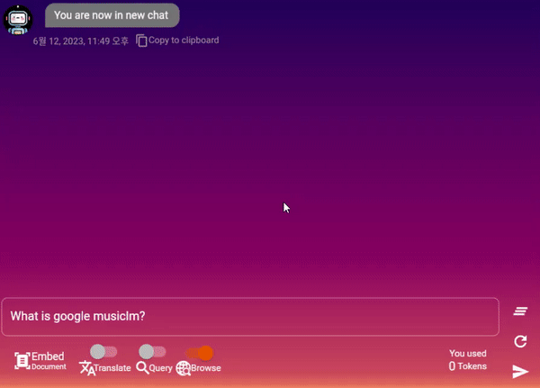
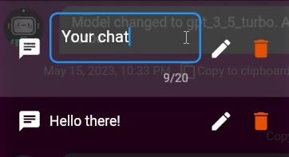
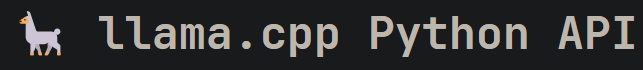

# LLMChat 🎉

👋 Welcome to the LLMChat repository, a full-stack implementation of an API server built with Python FastAPI, and a beautiful frontend powered by Flutter. 
💬 This project is designed to deliver a seamless chat experience with the advanced ChatGPT and other LLM models.
🔝 Offering a modern infrastructure that can be easily extended when GPT-4's Multimodal and Plugin features become available. 
🚀 Enjoy your stay!

## **Demo**
---
### **Enjoy the beautiful UI and rich set of customizable widgets provided by Flutter.**
- It supports both `mobile` and `PC` environments. 
- `Markdown` is also supported, so you can use it to format your messages.

---
### Web Browsing
+ #### **Duckduckgo**
    You can use the Duckduckgo search engine to find relevant information on the web. Just activate the 'Browse' toggle button!
    
    Watch the demo video for full-browsing: https://www.youtube.com/watch?v=mj_CVrWrS08
        
> 

---
### Vector Embedding
+ #### **Embed Any Text**
    With the `/embed` command, you can store the text indefinitely in your own private vector database and query it later, anytime. If you use the `/share` command, the text is stored in a public vector database that everyone can share. Enabling `Query` toggle button or `/query` command helps the AI generate contextualized answers by searching for text similarities in the public and private databases. This solves one of the biggest limitations of language models: **memory**. 

+ #### **Upload Your PDF File**
    You can embed PDF file by clicking `Embed Document` on the bottom left. In a few seconds, text contents of PDF will be converted to vectors and embedded to Redis cache.
> 
    

---
+ ### Change your chat model
    You can change your chat model by dropdown menu. You can define whatever model you want to use in `LLMModels` which is located in `app/models/llms.py`. 
    > 
---
+ ### Change your chat title
    You can change your chat title by clicking the title of the chat. This will be stored until you change or delete it!
    > 
---
+ ### LLaMa.cpp
    > 
    
    For the llama CPP model, it is assumed to work only in the local environment and uses the `http://localhost:8002/v1/completions` endpoint.  It continuously checks the status of the llama API server by connecting to `http://localhost:8002/health` once a second to see if a 200 OK response is returned, and if not, it automatically runs the `app.start_llama_cpp_server` module as a separate process to create a the API server.

---

## Key Features
- **FastAPI** - High-performance `web framework` for building APIs with Python.
- **Flutter** - `Webapp` frontend with beautiful UI and rich set of customizable widgets.
- **ChatGPT** - Seamless integration with the `OpenAI API` for text generation and message management.
- **LLAMA** - Suporting LocalLLM, `LlamaCpp`, with multiprocessing. 
- **WebSocket Connection** - `Real-time`, two-way communication with the ChatGPT, and other LLM models, with Flutter frontend webapp.
- **Vectorstore** - Using `Redis` and `Langchain`, store and retrieve vector embeddings for similarity search. It will help AI to generate more relevant responses.
- **Auto summarization** - Using Langchain's summarize chain, summarize the conversation and store it in the database. It will help saving a lot of tokens.
- **Web Browsing** - Using `Duckduckgo` search engine, browse the web and find relevant information.
- **Concurrency** - Asynchronous programming with `async`/`await` syntax for concurrency and parallelism.
- **Security** - Token validation and authentication to keep API secure.
- **Database** - Manage database connections and execute `MySQL` queries. Easily perform Create, Read, Update, and Delete actions, with `sqlalchemy.asyncio`
- **Cache** - Manage cache connections and execute `Redis` queries with aioredis. Easily perform Create, Read, Update, and Delete actions, with `aioredis`.


## Getting Started / Installation

To set up the on your local machine, follow these simple steps:

1. Clone the repository:

```bash
git clone https://github.com/c0sogi/LLMChat.git
```

2. Change to the project directory:

```bash
cd LLMChat
```

3. Create `.env` file and setup for fastapi server, referring to `.env-sample` file. Enter Database connection to create, OpenAI API Key, and other necessary configurations. Optionals are not required, just leave them blank.

4. To run the server, execute. It may take a few minutes to start the server for the first time:

```bash
docker-compose -f docker-compose-local.yaml up -d
```

5. To stop the server, execute:

```bash
docker-compose -f docker-compose-local.yaml down
```

6. Now you can access the server at `http://localhost:8000/docs` and the database at `db:3306` or `cache:6379`. You can also access the app at `http://localhost:8000/chat`.


Your Server should now be up and running, ready to provide an engaging chat experience!

# License

This project is licensed under the [MIT License](LICENSE), which allows for free use, modification, and distribution, as long as the original copyright and license notice are included in any copy or substantial portion of the software.


# Why FastAPI?

🚀 `FastAPI` is a modern web framework for building APIs with Python. 
💪 It has high performance, easy to learn, fast to code, and ready for production. 
👍 One of the main features of `FastAPI` is that it supports concurrency and `async`/`await` syntax. 
🤝 This means that you can write code that can handle multiple tasks at the same time without blocking each other, especially when dealing with I/O bound operations, such as network requests, database queries, file operations, etc.


# Why Flutter?

📱 `Flutter` is an open-source UI toolkit developed by Google for building native user interfaces for mobile, web, and desktop platforms from a single codebase. 
👨‍💻 It uses `Dart`, a modern object-oriented programming language, and provides a rich set of customizable widgets that can adapt to any design.


# WebSocket Connection

You can access `ChatGPT` or `LlamaCpp` through `WebSocket` connection using two modules: `app/routers/websocket` and `app/utils/chat/chat_stream_manager`. These modules facilitate the communication between the `Flutter` client and the Chat model through a WebSocket. With the WebSocket, you can establish a real-time, two-way communication channel to interact with the LLM.

## Usage

To start a conversation, connect to the WebSocket route `/ws/chat/{api_key}` with a valid API key registered in the database. Note that this API key is not the same as OpenAI API key, but only available for your server to validate the user. Once connected, you can send messages and commands to interact with the LLM model. The WebSocket will send back chat responses in real-time. This websocket connection is established via Flutter app, which can accessed with endpoint `/chat`.

## websocket.py

`websocket.py` is responsible for setting up a WebSocket connection and handling user authentication. It defines the WebSocket route `/chat/{api_key}` that accepts a WebSocket and an API key as parameters.

When a client connects to the WebSocket, it first checks the API key to authenticate the user. If the API key is valid, the `begin_chat()` function is called from the `stream_manager.py` module to start the conversation.

In case of an unregistered API key or an unexpected error, an appropriate message is sent to the client and the connection is closed.

```python
@router.websocket("/chat/{api_key}")
async def ws_chat(websocket: WebSocket, api_key: str):
    ...
```

## stream_manager.py

`stream_manager.py` is responsible for managing the conversation and handling user messages. It defines the `begin_chat()` function, which takes a WebSocket, a user ID as parameters.

The function first initializes the user's chat context from the cache manager. Then, it sends the initial message history to the client through the WebSocket.

The conversation continues in a loop until the connection is closed. During the conversation, the user's messages are processed and GPT's responses are generated accordingly.

```python
class ChatStreamManager:
    @classmethod
    async def begin_chat(cls, websocket: WebSocket, user: Users) -> None:
    ...
```


### Sending Messages to WebSocket

The `SendToWebsocket` class is used for sending messages and streams to the WebSocket. It has two methods: `message()` and `stream()`. The `message()` method sends a complete message to the WebSocket, while the `stream()` method sends a stream to the WebSocket.

```python
class SendToWebsocket:
    @staticmethod
    async def message(...):
        ...

    @staticmethod
    async def stream(...):
        ...
```

### Handling AI Responses

The `MessageHandler` class also handles AI responses. The `ai()` method sends the AI response to the WebSocket. If translation is enabled, the response is translated using the Google Translate API before sending it to the client.

```python
class MessageHandler:
    ...
    @staticmethod
    async def ai(...):
        ...
```

### Handling Custom Commands

User messages are processed using the `HandleMessage` class. If the message starts with `/`, such as `/YOUR_CALLBACK_NAME`. it is treated as a command and the appropriate command response is generated. Otherwise, the user's message is processed and sent to the LLM model for generating a response.


Commands are handled using the `ChatCommands` class. It executes the corresponding callback function depending on the command. You can add new commands by simply adding callback in `ChatCommands` class from `app.utils.chat.chat_commands`.


# 🌟Vector Embedding
 Using Redis for storing vector embeddings of conversations 🗨️ can aid the ChatGPT model 🤖 in several ways, such as efficient and fast retrieval of conversation context 🕵️‍♀️, handling large amounts of data 📊, and providing more relevant responses through vector similarity search 🔎.

Some fun examples of how this could work in practice:
- Imagine a user is chatting with ChatGPT about their favorite TV show 📺 and mentions a specific character 👤. Using Redis, ChatGPT could retrieve previous conversations where that character was mentioned and use that information to provide more detailed insights or trivia about that character 🤔.
- Another scenario could be a user discussing their travel plans ✈️ with ChatGPT. If they mention a particular city 🌆 or landmark 🏰, ChatGPT could use vector similarity search to retrieve previous conversations that discussed the same location and provide recommendations or tips based on that context 🧳. 
- If a user mentions a particular cuisine 🍝 or dish 🍱, ChatGPT could retrieve previous conversations that discussed those topics and provide recommendations or suggestions based on that context 🍴.


### 1. Embedding text using the `/embed` command

When a user enters a command in the chat window like `/embed <text_to_embed>`, the `VectorStoreManager.create_documents` method is called. This method converts the input text into a vector using OpenAI's `text-embedding-ada-002` model and stores it in the Redis vectorstore.

```python
@staticmethod
@command_response.send_message_and_stop
async def embed(text_to_embed: str, /, buffer: BufferedUserContext) -> str:
    """Embed the text and save its vectors in the redis vectorstore.\n
    /embed <text_to_embed>"""
    ...
```

### 2. Querying embedded data using the `/query` command

When the user enters the `/query <query>` command, the `asimilarity_search` function is used to find up to three results with the highest vector similarity to the embedded data in the Redis vectorstore. These results are temporarily stored in the context of the chat, which helps AI answer the query by referring to these data.

```python
@staticmethod
async def query(query: str, /, buffer: BufferedUserContext, **kwargs) -> Tuple[str | None, ResponseType]:
    """Query from redis vectorstore\n
    /query <query>"""
    ...
```

### 3. Automatically embedding uploaded text files

When running the `begin_chat` function, if a user uploads a file containing text (e.g., a PDF or TXT file), the text is automatically extracted from the file, and its vector embedding is saved to Redis.

```python
@classmethod
async def embed_file_to_vectorstore(cls, file: bytes, filename: str, collection_name: str) -> str:
    # if user uploads file, embed it
    ...
```

### 4. `commands.py` functionality

In the `commands.py` file, there are several important components:

- `command_response`: This class is used to set a decorator on the command method to specify the next action. It helps to define various response types, such as sending a message and stopping, sending a message and continuing, handling user input, handling AI responses, and more.
- `command_handler`: This function is responsible for performing a command callback method based on the text entered by the user.
- `arguments_provider`: This function automatically supplies the arguments required by the command method based on the annotation type of the command method.


# 📝 Auto Summarization
### There is a way to save tokens by adding a task to the LLM that summarizes the message. The auto summarization task is a crucial feature that enhances the efficiency of chatbot. Let's break down the functionality of this feature:


1. **Task Triggering**: This feature is activated whenever a user types a message or the AI responds with a message. At this point, an automatic summarization task is generated to condense the text content.

2. **Task Storage**: The auto-summarization task is then stored in the `task_list` attribute of the `BufferUserChatContext`. This serves as a queue for managing tasks linked to the user's chat context.

3. **Task Harvesting**: Following the completion of a user-AI question and answer cycle by the `MessageHandler`, the `harvest_done_tasks` function is invoked. This function collects the results of the summarization task, making sure nothing is left out.

4. **Summarization Application**: After the harvesting process, the summarized results replace the actual message when our chatbot is requesting answers from language learning models (LLMs), such as OPENAI and LLAMA_CPP. By doing so, we're able to send much more succinct prompts than the initial lengthy message.

5. **User Experience**: Importantly, from the user's perspective, they only see the original message. The summarized version of the message is not shown to them, maintaining transparency and avoiding potential confusion.

6. **Simultaneous Tasks**: Another key feature of this auto-summarization task is that it doesn't impede other tasks. In other words, while the chatbot is busy summarizing the text, other tasks can still be carried out, thereby improving the overall efficiency of our chatbot.

### By default, summarize chain only works for messages of 512 tokens or more. This can be turned on/off and the threshold set in `ChatConfig`.


# 📚 LLM Models

This repository contains different GPT LLM models, defined in `llms.py`. There are two main models: `LlamaCppModel` and `OpenAIModel`, inheriting from the base class `LLMModel`. Both models are designed for text generation. The `LLMModels` enum is a collection of these LLMs.

There also exists module `text_generation.py` that provides the functionality needed to integrate the OpenAI API with the chat. It handles the process of organizing message history, generating text from the OpenAI API, and managing the asynchronous streaming of generated text.


All operations are handled asynchronously🚀 and can be used by multiple users at the same time. In particular, the `LlamaCppModel` allows for parallel processing using multiprocessing and queues.


## 📌 Usage

The default LLM model used by the user via `UserChatContext.construct_default` is `gpt-3.5-turbo`. You can change the default for that function. To change the LLM model via command, type `/changemodel <model>` in the chat. The `<model>` defined here should correspond to the member defined in `LLMModels`.

## 📖 Model Descriptions

### 1️⃣ OpenAIModel

`OpenAIModel` generates text asynchronously by requesting Chat completion from the OpenAI server. It requires an OpenAI API key. As it uses an asynchronous client, the main thread remains unblocked.

### 2️⃣ LlamaCppModel

`LlamaCppModel` reads a locally stored LlamaCpp-compatible model and generates text in a new process. For example, it looks like `./llama_models/ggml/wizard-vicuna-13B.ggml.q5_1.bin`. You can download the required model from Huggingface. When generating text with this model, a processpool is created, and the Llama model is immediately cached in RAM. This allocation remains in memory until the processpool is forcibly terminated, such as by shutting down the server. By creating a new processpool and working in a different process, existing server processes are not blocked, and other users can generate text with the model simultaneously! More details are defined in `llama_cpp.py`.

## 📝 Handling Exceptions
Handle exceptions that may occur during text generation. If a `ChatLengthException` is thrown, it automatically performs a routine to re-limit the message to within the number of tokens limited by the `cutoff_message_histories` function, and resend it. This ensures that the user has a smooth chat experience regardless of the token limit.

# Behind the WebSocket Connection...

This project aims to create an API backend to enable the large language model chatbot service. It utilizes a cache manager to store messages and user profiles in Redis, and a message manager to safely cache messages so that the number of tokens does not exceed an acceptable limit.

## Cache Manager

The Cache Manager (`CacheManager`) is responsible for handling user context information and message histories. It stores these data in Redis, allowing for easy retrieval and modification. The manager provides several methods to interact with the cache, such as:

- `read_context_from_profile`: Reads the user's chat context from Redis, according to the user's profile.
- `create_context`: Creates a new user chat context in Redis.
- `reset_context`: Resets the user's chat context to default values.
- `update_message_histories`: Updates the message histories for a specific role (user, ai, or system).
- `lpop_message_history` / `rpop_message_history`: Removes and returns the message history from the left or right end of the list.
- `append_message_history`: Appends a message history to the end of the list.
- `get_message_history`: Retrieves the message history for a specific role.
- `delete_message_history`: Deletes the message history for a specific role.
- `set_message_history`: Sets a specific message history for a role and index.

## Message Manager

The Message Manager (`MessageManager`) ensures that the number of tokens in message histories does not exceed the specified limit. It safely handles adding, removing, and setting message histories in the user's chat context while maintaining token limits. The manager provides several methods to interact with message histories, such as:

- `add_message_history_safely`: Adds a message history to the user's chat context, ensuring that the token limit is not exceeded.
- `pop_message_history_safely`: Removes and returns the message history from the right end of the list while updating the token count.
- `set_message_history_safely`: Sets a specific message history in the user's chat context, updating the token count and ensuring that the token limit is not exceeded.

## Usage

To use the cache manager and message manager in your project, import them as follows:

```python
from app.utils.chat.managers.cache import CacheManager
from app.utils.chat.message_manager import MessageManager
```

Then, you can use their methods to interact with the Redis cache and manage message histories according to your requirements.

For example, to create a new user chat context:

```python
user_id = "example@user.com"  # email format
chat_room_id = "example_chat_room_id"  # usually the 32 characters from `uuid.uuid4().hex`
default_context = UserChatContext.construct_default(user_id=user_id, chat_room_id=chat_room_id)
await CacheManager.create_context(user_chat_context=default_context)
```

To safely add a message history to the user's chat context:

```python
user_chat_context = await CacheManager.read_context_from_profile(user_chat_profile=UserChatProfile(user_id=user_id, chat_room_id=chat_room_id))
content = "This is a sample message."
role = ChatRoles.USER  # can be enum such as ChatRoles.USER, ChatRoles.AI, ChatRoles.SYSTEM
await MessageManager.add_message_history_safely(user_chat_context, content, role)
```


# Middlewares

This project uses `token_validator` middleware and other middlewares used in the FastAPI application. These middlewares are responsible for controlling access to the API, ensuring only authorized and authenticated requests are processed.

## Examples

The following middlewares are added to the FastAPI application:

1. Access Control Middleware: Ensures that only authorized requests are processed.
2. CORS Middleware: Allows requests from specific origins, as defined in the app configuration.
3. Trusted Host Middleware: Ensures that requests are coming from trusted hosts, as defined in the app configuration.

### Access Control Middleware

The Access Control Middleware is defined in the `token_validator.py` file. It is responsible for validating API keys and JWT tokens.

#### State Manager

The `StateManager` class is used to initialize request state variables. It sets the request time, start time, IP address, and user token.

#### Access Control

The `AccessControl` class contains two static methods for validating API keys and JWT tokens:

1. `api_service`: Validates API keys by checking the existence of required query parameters and headers in the request. It calls the `Validator.api_key` method to verify the API key, secret, and timestamp.
2. `non_api_service`: Validates JWT tokens by checking the existence of the 'authorization' header or 'Authorization' cookie in the request. It calls the `Validator.jwt` method to decode and verify the JWT token.

#### Validator

The `Validator` class contains two static methods for validating API keys and JWT tokens:

1. `api_key`: Verifies the API access key, hashed secret, and timestamp. Returns a `UserToken` object if the validation is successful.
2. `jwt`: Decodes and verifies the JWT token. Returns a `UserToken` object if the validation is successful.

#### Access Control Function

The `access_control` function is an asynchronous function that handles the request and response flow for the middleware. It initializes the request state using the `StateManager` class, determines the type of authentication required for the requested URL (API key or JWT token), and validates the authentication using the `AccessControl` class. If an error occurs during the validation process, an appropriate HTTP exception is raised.

### Token

Token utilities are defined in the `token.py` file. It contains two functions:

1. `create_access_token`: Creates a JWT token with the given data and expiration time.
2. `token_decode`: Decodes and verifies a JWT token. Raises an exception if the token is expired or cannot be decoded.

### Params Utilities

The `params_utils.py` file contains a utility function for hashing query parameters and secret key using HMAC and SHA256:

1. `hash_params`: Takes query parameters and secret key as input and returns a base64 encoded hashed string.

### Date Utilities

The `date_utils.py` file contains the `UTC` class with utility functions for working with dates and timestamps:

1. `now`: Returns the current UTC datetime with an optional hour difference.
2. `timestamp`: Returns the current UTC timestamp with an optional hour difference.
3. `timestamp_to_datetime`: Converts a timestamp to a datetime object with an optional hour difference.

### Logger

The `logger.py` file contains the `api_logger` function, which logs API request and response information, including the request URL, method, status code, client information, processing time, and error details (if applicable). The logger function is called at the end of the `access_control` function to log the processed request and response.

## Usage

To use the `token_validator` middleware in your FastAPI application, simply import the `access_control` function and add it as a middleware to your FastAPI instance:

```python
from app.middlewares.token_validator import access_control

app = FastAPI()

app.add_middleware(dispatch=access_control, middleware_class=BaseHTTPMiddleware)
```

Make sure to also add the CORS and Trusted Host middlewares for complete access control:

```python
app.add_middleware(
    CORSMiddleware,
    allow_origins=config.allowed_sites,
    allow_credentials=True,
    allow_methods=["*"],
    allow_headers=["*"],
)

app.add_middleware(
    TrustedHostMiddleware,
    allowed_hosts=config.trusted_hosts,
    except_path=["/health"],
)
```

Now, any incoming requests to your FastAPI application will be processed by the `token_validator` middleware and other middlewares, ensuring that only authorized and authenticated requests are processed.

# Database Connection

This module `app.database.connection` provides an easy-to-use interface for managing database connections and executing SQL queries using SQLAlchemy and Redis. It supports MySQL, and can be easily integrated with this project.

## Features

- Create and drop databases
- Create and manage users
- Grant privileges to users
- Execute raw SQL queries
- Manage database sessions with async support
- Redis caching support for faster data access


## Usage

First, import the required classes from the module:

```python
from app.database.connection import MySQL, SQLAlchemy, CacheFactory
```

Next, create an instance of the `SQLAlchemy` class and configure it with your database settings:

```python
from app.common.config import Config

config: Config = Config.get()
db = SQLAlchemy()
db.start(config)
```

Now you can use the `db` instance to execute SQL queries and manage sessions:

```python
# Execute a raw SQL query
result = await db.execute("SELECT * FROM users")

# Use the run_in_session decorator to manage sessions
@db.run_in_session
async def create_user(session, username, password):
    await session.execute("INSERT INTO users (username, password) VALUES (:username, :password)", {"username": username, "password": password})

await create_user("JohnDoe", "password123")
```

To use Redis caching, create an instance of the `CacheFactory` class and configure it with your Redis settings:

```python
cache = CacheFactory()
cache.start(config)
```

You can now use the `cache` instance to interact with Redis:

```python
# Set a key in Redis
await cache.redis.set("my_key", "my_value")

# Get a key from Redis
value = await cache.redis.get("my_key")
```
In fact, in this project, the `MySQL` class does the initial setup at app startup, and all database connections are made with only the `db` and `cache` variables present at the end of the module. 😅 

All db settings will be done in `create_app()` in `app.common.app_settings`.
For example, the `create_app()` function in `app.common.app_settings` will look like this:

```python
def create_app(config: Config) -> FastAPI:
    # Initialize app & db & js
    new_app = FastAPI(
        title=config.app_title,
        description=config.app_description,
        version=config.app_version,
    )
    db.start(config=config)
    cache.start(config=config)
    js_url_initializer(js_location="app/web/main.dart.js")
    # Register routers
    # ...
    return new_app
```

# Database CRUD Operations

This project uses simple and efficient way to handle database CRUD (Create, Read, Update, Delete) operations using SQLAlchemy and two module and path: `app.database.models.schema` and `app.database.crud`. 

## Overview

### app.database.models.schema

The `schema.py` module is responsible for defining database models and their relationships using SQLAlchemy. It includes a set of classes that inherit from `Base`, an instance of `declarative_base()`. Each class represents a table in the database, and its attributes represent columns in the table. These classes also inherit from a `Mixin` class, which provides some common methods and attributes for all the models.

#### Mixin Class

The Mixin class provides some common attributes and methods for all the classes that inherit from it. Some of the attributes include:

- `id`: Integer primary key for the table.
- `created_at`: Datetime for when the record was created.
- `updated_at`: Datetime for when the record was last updated.
- `ip_address`: IP address of the client that created or updated the record.

It also provides several class methods that perform CRUD operations using SQLAlchemy, such as:

- `add_all()`: Adds multiple records to the database.
- `add_one()`: Adds a single record to the database.
- `update_where()`: Updates records in the database based on a filter.
- `fetchall_filtered_by()`: Fetches all records from the database that match the provided filter.
- `one_filtered_by()`: Fetches a single record from the database that matches the provided filter.
- `first_filtered_by()`: Fetches the first record from the database that matches the provided filter.
- `one_or_none_filtered_by()`: Fetches a single record or returns `None` if no records match the provided filter.

### app.database.crud
The `users.py` and `api_keys.py` module contains a set of functions that perform CRUD operations using the classes defined in `schema.py`. These functions use the class methods provided by the Mixin class to interact with the database.

Some of the functions in this module include:

- `create_api_key()`: Creates a new API key for a user.
- `get_api_keys()`: Retrieves all API keys for a user.
- `get_api_key_owner()`: Retrieves the owner of an API key.
- `get_api_key_and_owner()`: Retrieves an API key and its owner.
- `update_api_key()`: Updates an API key.
- `delete_api_key()`: Deletes an API key.
- `is_email_exist()`: Checks if an email exists in the database.
- `get_me()`: Retrieves user information based on user ID.
- `is_valid_api_key()`: Checks if an API key is valid.
- `register_new_user()`: Registers a new user in the database.
- `find_matched_user()`: Finds a user with a matching email in the database.

## Usage

To use the provided CRUD operations, import the relevant functions from the `crud.py` module and call them with the required parameters. For example:

```python
import asyncio
from app.database.crud.users import register_new_user, get_me, is_email_exist
from app.database.crud.api_keys import create_api_key, get_api_keys, update_api_key, delete_api_key

async def main():
    # `user_id` is an integer index in the MySQL database, and `email` is user's actual name
    # the email will be used as `user_id` in chat. Don't confuse with `user_id` in MySQL

    # Register a new user
    new_user = await register_new_user(email="test@test.com", hashed_password="...")

    # Get user information
    user = await get_me(user_id=1)

    # Check if an email exists in the database
    email_exists = await is_email_exist(email="test@test.com")

    # Create a new API key for user with ID 1
    new_api_key = await create_api_key(user_id=1, additional_key_info={"user_memo": "Test API Key"})

    # Get all API keys for user with ID 1
    api_keys = await get_api_keys(user_id=1)

    # Update the first API key in the list
    updated_api_key = await update_api_key(updated_key_info={"user_memo": "Updated Test API Key"}, access_key_id=api_keys[0].id, user_id=1)

    # Delete the first API key in the list
    await delete_api_key(access_key_id=api_keys[0].id, access_key=api_keys[0].access_key, user_id=1)

if __name__ == "__main__":
    asyncio.run(main())
```